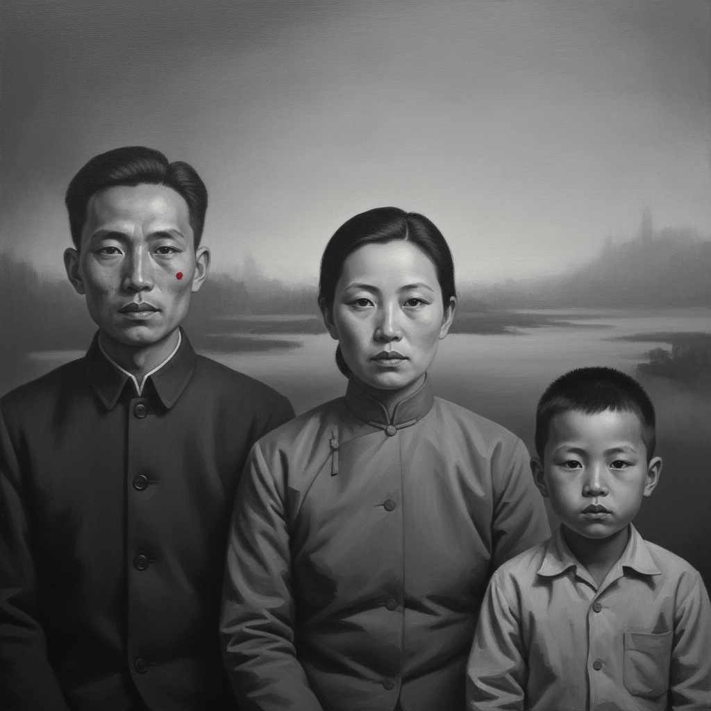

# Zhang Xiaogang 张晓刚

> **流派**: 当代绘画 · 中国当代艺术  
> **时期**: 1958–至今 中国  
> **关键词**: 血缘大家庭、集体记忆、老照片美学、身份政治

## 概述

张晓刚是中国当代艺术市场最具标志性的画家之一。他的"血缘：大家庭"系列以1950-70年代中国家庭合影照为蓝本，用灰色调的超现实手法重新绘制——人物面容相似却略有不同，眼神空洞而忧郁，皮肤上偶尔出现红色胎记般的斑点。这些画作探索了集体主义时代个人身份的消融与残存。

## 视觉特征

- **灰色调**: 整体偏灰偏冷的色调，如褪色老照片
- **标准化面孔**: 人物五官相似，表情统一而空洞
- **红色斑点**: 面部或身体上的红色胎记/印记
- **正面构图**: 模仿证件照或家庭合影的正面姿态
- **平滑表面**: 极其光滑的画面，无可见笔触

## 代表作品

- 《血缘：大家庭》系列 (1993–)
- 《失忆与记忆》系列
- 《绿墙》系列
- 《描述》系列

## 历史影响

张晓刚为中国当代艺术在国际市场上的崛起做出了关键贡献。他的"大家庭"系列成为理解中国集体主义历史和个人身份焦虑的视觉符号，影响了整整一代中国当代画家。

## 相关风格

- [Chinese Contemporary Art 中国当代艺术](chinese-contemporary-art.md)
- [Yue Minjun 岳敏君](yue-minjun.md)
- [Zeng Fanzhi 曾梵志](zeng-fanzhi.md)
