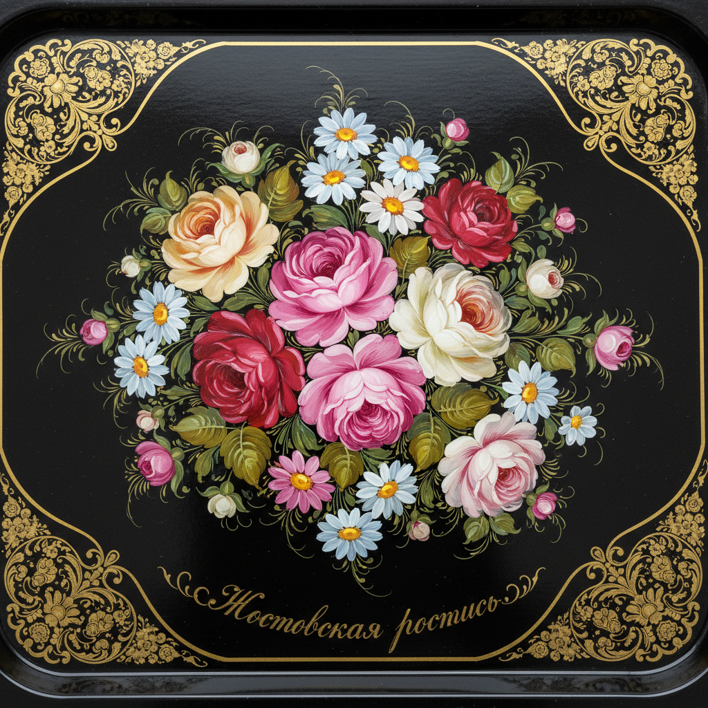

# Zhostovo 日斯托沃托盘画 | Жостовская роспись

> **"黑色漆面上的花束——俄罗斯铁匠村的金属花园。"**

## 概述

日斯托沃托盘画（Zhostovo / Жостовская роспись）是俄罗斯莫斯科州日斯托沃村的传统金属托盘装饰绘画艺术，起源于1825年。艺术家在黑色（或深色）漆面金属托盘上手绘精美的花束图案，以其写实而又装饰性的花卉、丰富的色彩层次和独特的"浮雕感"光影效果著称。每个托盘都是手工锻造、手工绘制的独一无二的艺术品。2019年被列入俄罗斯非物质文化遗产名录。

## 制作工艺

1. **金属锻造**：手工锻造铁质托盘
2. **底漆**：多层黑色漆底（也有红、蓝、绿底）
3. **底稿（замалёвок）**：用稀释颜料画出花卉位置
4. **阴影（тенёжка）**：添加暗部阴影
5. **铺色（прокладка）**：主要色彩层
6. **高光（бликовка）**：添加光泽和高光
7. **细节（чертёжка）**：花蕊、叶脉等精细细节
8. **装饰边框（уборка）**：金色边框装饰
9. **清漆**：多层透明漆保护

## 核心特征

- **黑色底色**：深色漆面衬托花卉的鲜艳
- **花束构图**：中心花束向四周展开
- **写实花卉**：玫瑰、牡丹、雏菊等写实描绘
- **光影效果**：多层绘制创造立体感
- **金色边框**：精美的金色装饰边框
- **自由构图**：每位画师有独特的构图风格

## 常见花卉

| 花卉 | 特征 |
|------|------|
| 玫瑰 | 最经典，多层花瓣 |
| 牡丹 | 大朵华丽 |
| 雏菊 | 小巧点缀 |
| 矢车菊 | 蓝色点缀 |
| 罂粟 | 红色亮点 |
| 野花和浆果 | 填充和过渡 |

## 视觉特征

- 黑色底上的鲜艳花卉
- 多层绘制的立体光影
- 金色边框的精美装饰
- 花束的自然流动感
- 写实与装饰的完美平衡
- 漆面的深邃光泽

## 与其他风格的关系

| 风格 | 关系 |
|------|------|
| 荷兰花卉静物画 | 共享写实花卉传统 |
| 俄罗斯Khokhloma | 共享俄罗斯漆器装饰传统 |
| 乌克兰Petrykivka | 共享东斯拉夫花卉装饰 |
| 日本漆器 | 共享漆面装饰传统 |
| 当代花卉设计 | Zhostovo影响俄罗斯当代设计 |

## 概念图

---

*浮光艺志 | Chronicle of Artistry*
