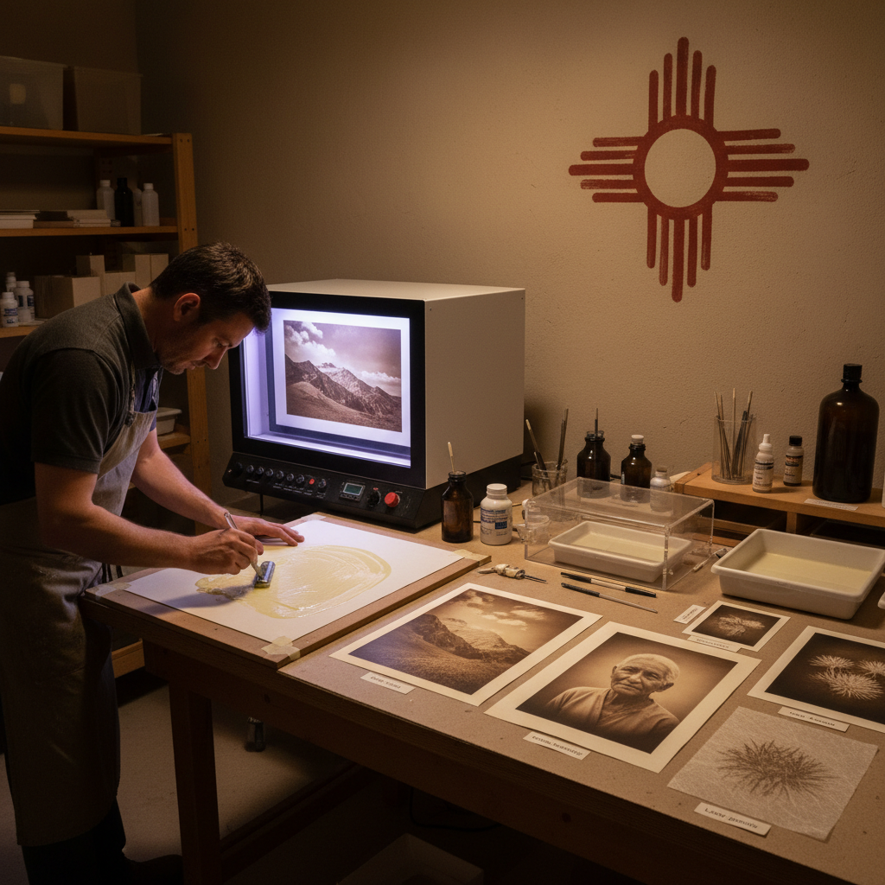

# Ziatype 齐亚版印刷

> "Ziatype is platinum printing reimagined — a simplified palladium process that produces prints with the luminous warmth and archival permanence of noble metals, yet with a gentler learning curve and more forgiving chemistry, named for the Zia sun symbol that represents the light that creates each image." — Unknown

## 概述

齐亚版印刷（Ziatype）是一种由美国摄影师Richard Sullivan在1990年代发明的钯基（palladium-based）替代摄影印刷工艺。齐亚版是对传统铂钯印刷的简化和改进——使用锂钯氯化物（lithium palladium chloride）作为主要感光金属盐，配合草酸铁铵作为感光剂。"Zia"取自美国新墨西哥州Zia Pueblo部落的太阳符号——象征创造图像的光线。

齐亚版印刷相比传统铂钯印刷的优势：化学配方更简单、对湿度不那么敏感、曝光宽容度更大、可以产生更丰富的色调范围。齐亚版印刷品具有钯金属的温暖棕黑色调、极其精细的色调过渡和优秀的永久性（贵金属图像）。齐亚版是当代替代摄影中最受欢迎的贵金属印刷工艺之一。

## 核心特征

| 特征 | 描述 |
|------|------|
| 钯基 | 钯金属为主 |
| 简化 | 简化的铂钯工艺 |
| 永久 | 贵金属的永久性 |
| 宽容 | 曝光宽容度大 |
| 温暖 | 温暖的色调 |
| 当代 | 当代发明的工艺 |

## 视觉特征

- **温暖**：温暖的棕黑色调
- **柔和**：极其柔和的色调
- **深度**：丰富的暗部细节
- **哑光**：哑光的表面质感
- **纸感**：金属嵌入纸纤维
- **永恒**：永恒的质感

## 代表作品

| 作品 | 艺术家 | 年代 | 意义 |
|------|--------|------|------|
| *Ziatype prints* | Richard Sullivan | 1990s | 技法的发明 |
| *Ziatype landscapes* | Various | 当代 | 齐亚版风景 |
| *Ziatype portraits* | Various | 当代 | 齐亚版肖像 |
| *Contemporary ziatypes* | Various | 当代 | 当代齐亚版 |

## 历史时间线

| 时期 | 事件 |
|------|------|
| 1873年 | Willis发明铂金印刷（前身） |
| 1990年代 | Richard Sullivan发明ziatype |
| 2000年代 | 齐亚版在替代摄影中的推广 |
| 当代 | 齐亚版印刷的全球发展 |

## 中国语境

齐亚版印刷在中国的替代摄影社区中有逐步的引入。中国的一些高级替代摄影工作坊开始教授齐亚版技法——作为铂钯印刷的更易入门的替代方案。齐亚版因其"简化的贵金属工艺"特点，对追求高品质手工印刷的中国摄影师有吸引力。中国的替代摄影材料供应商开始提供齐亚版所需的化学药品。

## AI生成概念图

## 与其他风格的关系

- **Platinum Palladium Printing** → 铂钯印刷
- **Kallitype** → 卡利版印刷
- **Van Dyke Brown** → 范戴克棕印刷
- **Cyanotype** → 氰版印刷
- **Alternative Photography** → 替代摄影
- **Carbon Printing** → 碳素印刷

---

*浮光艺志 | Chronicle of Artistry*
