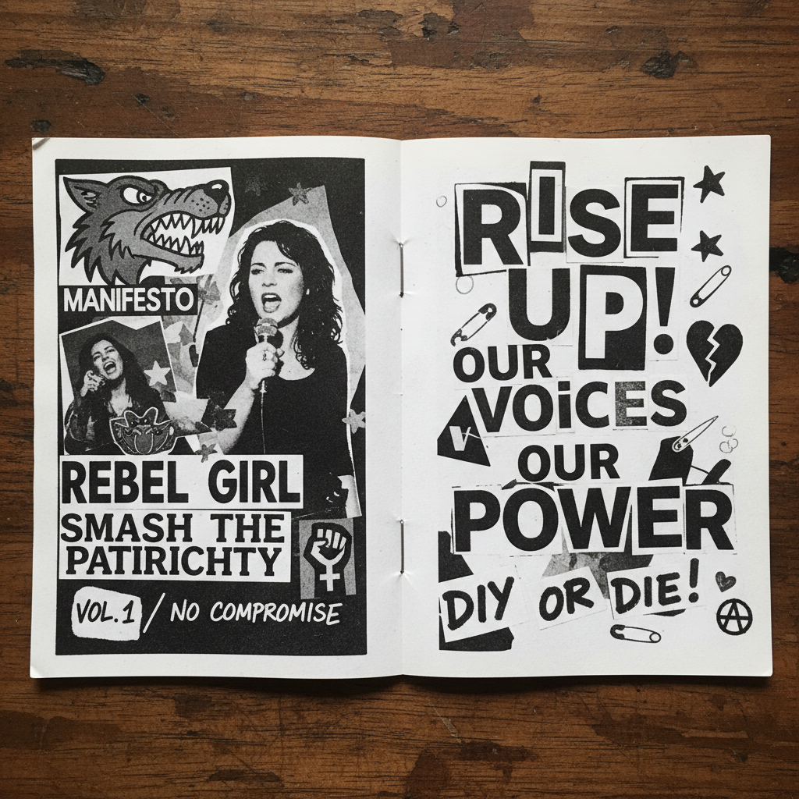

# Zine Culture 独立出版文化



> **"复印机、订书钉、手写字——在没有许可的情况下出版你自己的世界。"**

## 概述

| 维度 | 描述 |
|------|------|
| 时期 | 1930s（科幻粉丝）/1970s（朋克）/2010s（复兴）–至今 |
| 别名 | Zine, Fanzine, Self-publishing, 独立小册子 |
| 核心色彩 | 黑白复印+手工色彩、荧光色点缀 |
| 关键元素 | 复印机美学、手写字、拼贴、DIY装订、小批量 |
| 代表人物 | Riot Grrrl zines, Punk zines, 当代独立出版社 |
| 关联风格 | Punk, Riot Grrrl, Risograph, Collage, DIY |

---

## 历史脉络

| 年份 | 事件 |
|------|------|
| 1930s | 科幻粉丝杂志(Fanzine)——Zine 的起源 |
| 1970s | 朋克 Zine——Sniffin' Glue 等 |
| 1991 | Riot Grrrl Zine——女性主义DIY出版 |
| 2000s | 博客时代——Zine 暂时衰落 |
| 2010s | Zine Fair 全球复兴——物理出版的回归 |
| 2020s | Zine + Riso + 独立书店 = 新生态 |

### 核心哲学

Zine Culture 的精神是**"不需要出版社的许可——复印机就是你的印刷厂"**：
- DIY = 核心（"自己写、自己印、自己发"）
- 无许可 = 自由（"没有编辑、没有审查、没有市场"）
- 小批量 = 亲密（"50份比50万份更有意义"）
- 不完美 = 真实（"复印机的噪点就是我们的签名"）
- "Zine 是最民主的出版形式——任何人都可以做"

---

## 视觉语法

### 色彩系统

```
主色：
  黑色 (#000000) — 复印机墨粉
  白色 (#FFFFFF) — 纸张

辅色（手工添加）：
  荧光色 — 手工贴纸/印章
  红色 — 手写标记
  任何颜色 — 拼贴材料

规则：
  - 黑白复印为基础
  - 手工色彩为点缀
  - 不追求"印刷品质"
  - 材料决定外观

质感：
  复印 — 噪点、对比度高
  手写 — 不规则、个人
  拼贴 — 剪切、粘贴
  订书钉 — 装订痕迹
```

### 标志性元素

| 类别 | 元素 |
|------|------|
| 工具 | 复印机、剪刀、胶水、订书机、打字机 |
| 技法 | 拼贴、手写、复印、盖章、涂鸦 |
| 载体 | A5/A6小册子、折页、单页 |
| 内容 | 个人故事、政治、音乐、艺术、日常 |
| 发行 | Zine Fair、独立书店、邮寄、交换 |
| 态度 | DIY、反商业、个人、社区、自由 |

---

## 与千禧怀旧的关系

### 物理出版的数字时代复兴
- 2010s Zine 复兴 = 对数字疲劳的物理回应
- "在所有人都在发推特的时代——做一本Zine是一种反叛"
- Zine Fair 成为全球城市文化活动
- "Zine 是社交媒体的反面——慢、物理、有限"

### 与 Riot Grrrl 的传承
- 1990s Riot Grrrl Zine → 2010s 女性主义Zine复兴
- Zine 作为边缘群体的发声工具
- "Zine 给了没有平台的人一个平台"

---

## 中国语境

- 中国独立出版/Zine社区（abC Art Book Fair等）
- 中国城市的Zine Fair文化
- 与中国"独立文化"运动的关系
- 中国艺术家/设计师的Zine实践

---

## 设计应用

| 场景 | 应用方式 |
|------|----------|
| 出版 | 独立小册子+个人出版+艺术书 |
| 品牌 | DIY+手工+真实+社区+反商业 |
| 活动 | Zine Fair+工作坊+交换+社区 |
| 数字 | 复印机美学+手写+拼贴+噪点 |

---

## 相关风格

← [Risograph 孔版印刷美学](risograph.md) | [Punk 朋克](punk.md) →

↑ [返回千禧怀旧目录](README.md) | [返回总目录](../README.md)
