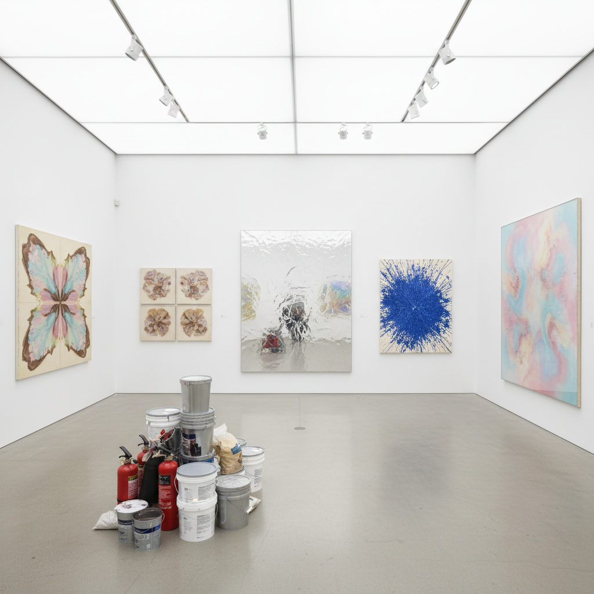

# Zombie Formalism Art 僵尸形式主义艺术

> "Zombie Formalism is what happens when the art market's appetite for abstraction meets the efficiency of mass production — paintings that look like art, that have the surface characteristics of serious abstract painting, that photograph well for Instagram and fit perfectly above a collector's sofa, but that are produced with the mechanical indifference of a factory, process-based works where the artist sets up a system and lets gravity or chemistry do the rest, creating canvases that are simultaneously beautiful and empty, decorative and conceptual, valuable and meaningless — the perfect commodity for an art market that has forgotten what it is buying." — Walter Robinson

## 概述

僵尸形式主义（Zombie Formalism）是艺术评论家沃尔特·罗宾逊（Walter Robinson）在2014年创造的术语，用于描述2010年代初期在纽约艺术市场中流行的一类抽象绘画。这些作品通常采用"过程导向"的方法——艺术家设置一个物理或化学过程（倾倒、滴落、折叠、燃烧等），然后让材料自行产生效果，创造出看起来既"抽象"又"美丽"的画面。

僵尸形式主义的代表艺术家包括卢西恩·史密斯（Lucien Smith）、雅各布·卡塞（Jacob Kassay）、帕克·伊藤（Parker Ito）和奥斯卡·穆里略（Oscar Murillo）。这些艺术家在20多岁时就在拍卖会上获得了六位数的价格，但批评家指出这些作品缺乏深度——它们是为Instagram和收藏家的客厅而设计的"安全"抽象画，是形式主义的"僵尸"——外表像艺术，但内部已经死亡。

## 核心特征

| 特征 | 描述 |
|------|------|
| 过程 | 过程导向的制作 |
| 表面 | 美丽的表面效果 |
| 商品 | 高度商品化 |
| 空洞 | 概念的空洞 |
| 装饰 | 装饰性的抽象 |
| 市场 | 市场驱动的生产 |

## 视觉特征

- **倾倒**：颜料的倾倒和流动
- **化学**：化学反应的痕迹
- **金属**：银色和金属光泽
- **单色**：接近单色的画面
- **纹理**：有趣的表面纹理
- **大尺幅**：适合展示的大尺幅

## 代表作品

| 作品 | 艺术家 | 年代 | 意义 |
|------|--------|------|------|
| *Rain paintings* | Lucien Smith | 2011 | 消防灭火器喷射 |
| *Silver paintings* | Jacob Kassay | 2010 | 电镀银的画布 |
| *Poured paintings* | Various | 2010年代 | 倾倒颜料的作品 |
| *Burned canvases* | Various | 2010年代 | 燃烧画布的作品 |
| *Folded paintings* | Various | 2010年代 | 折叠画布的作品 |

## 历史时间线

| 时期 | 事件 |
|------|------|
| 2010-11 | 年轻抽象画家的市场热潮 |
| 2012-13 | 拍卖价格的飙升 |
| 2014 | Walter Robinson命名"僵尸形式主义" |
| 2015-16 | 市场泡沫的破裂 |
| 当代 | 对市场驱动艺术的反思 |

## 中国语境

僵尸形式主义现象在中国艺术市场中有明显的对应。中国的当代艺术市场在2000年代和2010年代也经历了类似的投机热潮——大量"看起来像当代艺术"的作品被快速生产和交易，价格与艺术价值严重脱节。中国的一些批评家也指出了类似的问题：市场驱动的艺术生产导致了大量表面华丽但缺乏深度的作品。这个现象引发了关于艺术价值、市场泡沫和创作真诚性的广泛讨论。中国的"抽象热"在某种程度上也反映了僵尸形式主义的逻辑——抽象画因其"安全"和"装饰性"而受到收藏家的青睐。

## AI生成概念图

## 与其他风格的关系

- **Abstract Expressionism** → 抽象表现主义
- **Color Field** → 色域绘画
- **Process Art** → 过程艺术
- **Minimalism** → 极简主义
- **Post-Painterly Abstraction** → 后绘画性抽象
- **Market Art** → 市场艺术

---

*浮光艺志 | Chronicle of Artistry*
