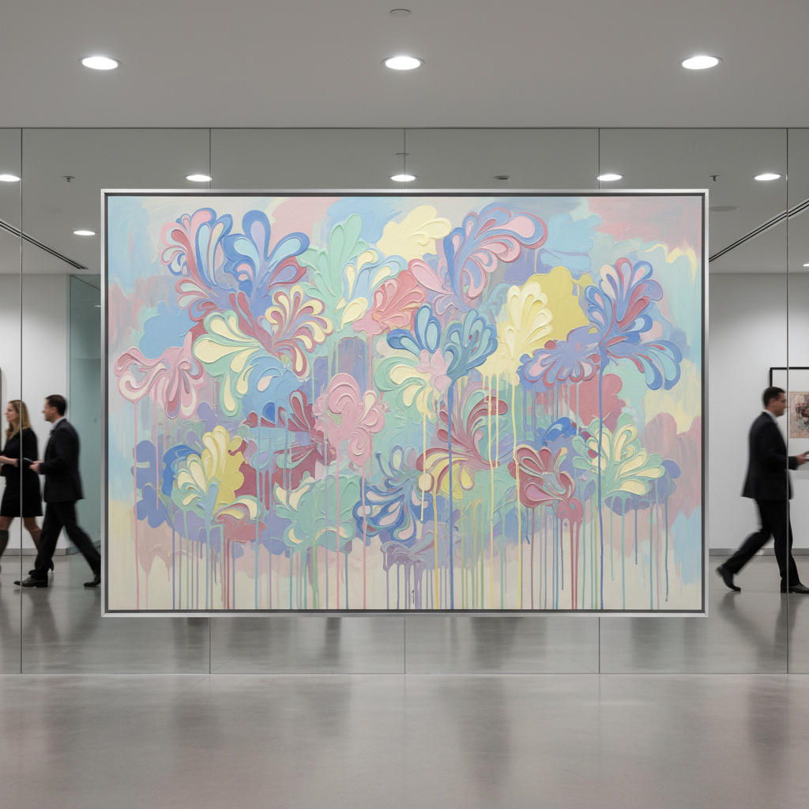

# Zombie Formalism 僵尸形式主义

> **时期：** 2010年代  
> **关键词：** 市场驱动、过程抽象、装饰性、投机泡沫、批评术语

## 概述

Zombie Formalism（僵尸形式主义）是批评家沃尔特·罗宾逊于2014年创造的贬义术语，描述2010年代艺术市场中大量涌现的"安全"抽象画——它们看起来像抽象表现主义，但缺乏精神深度；过程看似随机，实则高度可预测；装饰性强，适合挂在豪宅和企业大厅。它揭示了当代艺术市场如何将形式创新变为投机商品。

## 风格特征

- **过程痕迹**：倾倒、滴洒、刮擦的表面效果
- **装饰性**：适合室内设计的和谐色彩
- **可预测**：看似随机实则公式化的创作
- **中等尺幅**：适合收藏和转售的标准尺寸
- **表面吸引**：即时的视觉愉悦感

## 代表人物与作品

- 卢西恩·史密斯 火焰画
- 奥斯卡·穆里略 涂鸦画布
- 帕克·伊藤 漂白牛仔布
- 雅各布·卡塞 过程抽象

## 概念图

